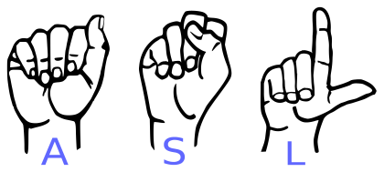
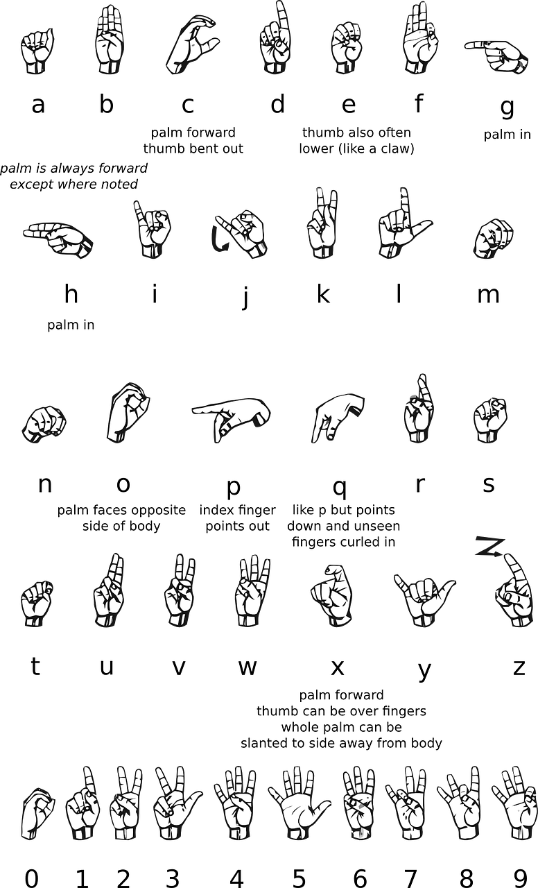
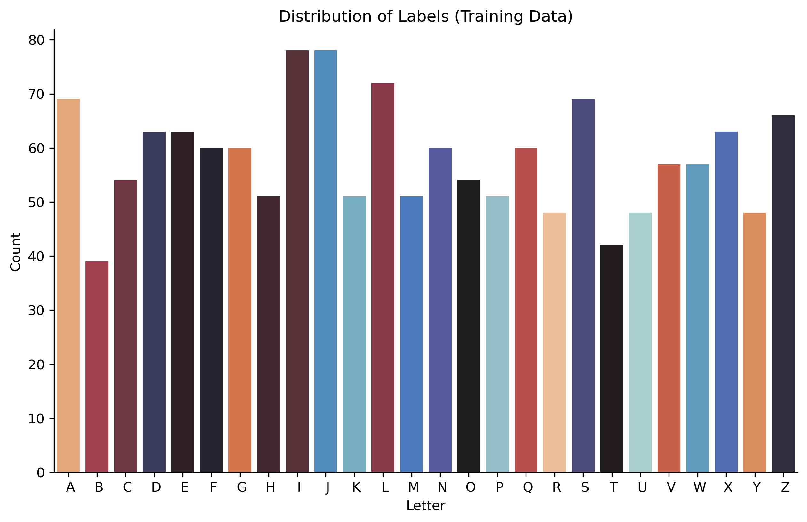
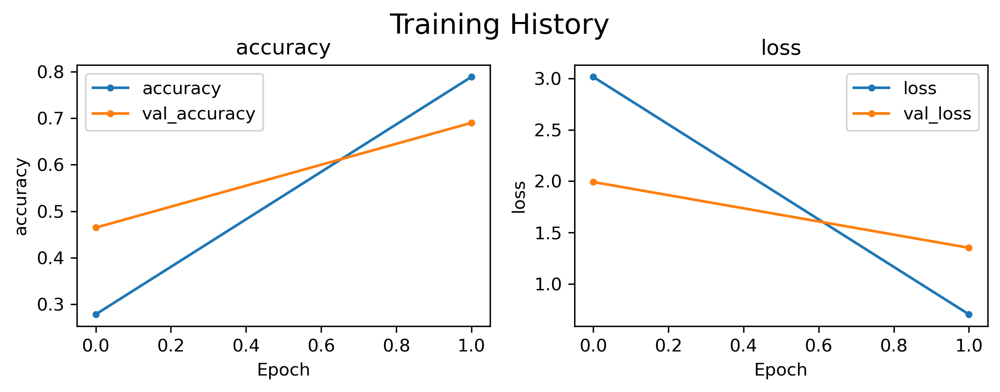
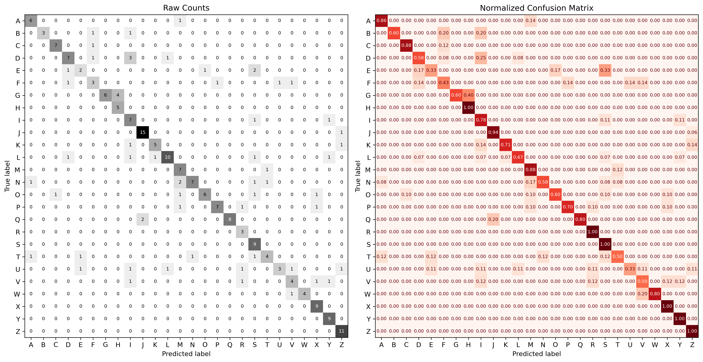

# computer-vision-american-sign-language

-  Last Updated: 06/03/2024

<center>
<p>By Psiĥedelisto - Own work, Public Domain, <a href="https://commons.wikimedia.org/w/index.php?curid=53652991">"https://commons.wikimedia.org/w/index.php?curid=53652991</a><p>
</center>

## Description

This project aims to develop a computer vision system for American Sign Language (ASL) recognition. 


### Goals 
> - **The first/primary goal is to create a model that can classify images of letters from the ASL alphabet (26-class multi-classification)**
- Create a streamlit application that will accept an image and predict which letter it is.

> - **The second, above-and-beyond goal is to use video as the input and add object detection.**

### Features

- ASL letter and word translation
- User-friendly interface
- Support for multiple hand gestures

<center> 

<p><a href="https://commons.wikimedia.org/wiki/File:Sign_language_alphabet_(58).png">Image Source</a> </p>
<p> Raziakhatun12, CC BY-SA 4.0 <https://creativecommons.org/licenses/by-sa/4.0>, via Wikimedia Commons</p>

</center>


## Data

### Source/Download
- Public Dataset from [Roboflow](https://public.roboflow.com/object-detection/american-sign-language-letters)


To download:
- Navigate to https://public.roboflow.com/object-detection/american-sign-language-letters
- Click `->` for Downloads.
- Select Format =  Multi-Label Classifiction
- Download zip to computer


### Data Details
- 26 letters of the alphabet
- J and Z are gesture-based letters and will likely be difficult to classify using static images.

- Number of Images: 1731
- Size: 416 x  416 
- Channels: 3

Example of Each letter:


## EDA


### Class Balance





### Methods


- Loading Images as a Tensorflow Dataset object.
    - Image size: 128 x 128
    - Batch size: 32   
    - No data augmentation due to nature of sign language.

- Constructing Convolutional Neural Networks in tensorflow.
- Applying transfer learning with pretrained models
- Explain image classifications using  Lime's ImageExplainer.


## Results

|   Rank | Name                             |   Precision |   Recall |   F1-Score |   Accuracy | Fit Time       | Model Save Fpath                                 |
|-------:|:---------------------------------|------------:|---------:|-----------:|-----------:|:---------------|:-------------------------------------------------|
|      1 | EfficientNetB0-1                 |       0.772 |    0.769 |      0.754 |      0.763 | 0:02:04.131142 | modeling/models/EfficientNetB0-1                 |
|      2 | VGG16-01                         |       0.539 |    0.534 |      0.518 |      0.535 | 0:01:55.297751 | modeling/models/VGG16-01                         |
|      3 | cnn1-fixed-lr                    |       0.355 |    0.359 |      0.347 |      0.368 | 0:00:21.583943 | modeling/models/cnn1-fixed-lr                    |
|      3 | cnn1-scheduled-lr                |       0.355 |    0.359 |      0.346 |      0.368 | 0:00:22.408392 | modeling/models/cnn1-scheduled-lr                |
|      5 | towards-data-science             |       0.386 |    0.318 |      0.316 |      0.342 | 0:01:43.888912 | modeling/models/towards-data-science             |
|      6 | towards-data-science_lr-schedule |       0.312 |    0.288 |      0.271 |      0.294 | 0:04:23.701543 | modeling/models/towards-data-science_lr-schedule |

### Best Model

- EfficientNetB0-1


#### Test Results




```
--------------------------------------------------------------------------------
 Classification Metrics: Test Data 
--------------------------------------------------------------------------------
              precision    recall  f1-score   support

           A       1.00      1.00      1.00        13
           B       0.75      0.60      0.67         5
           C       1.00      0.70      0.82        10
           D       0.67      0.67      0.67         9
           E       0.89      0.89      0.89         9
           F       0.75      0.43      0.55         7
           G       0.77      1.00      0.87        10
           H       0.86      0.60      0.71        10
           I       0.69      0.53      0.60        17
           J       0.67      1.00      0.80         6
           K       1.00      1.00      1.00         5
           L       0.82      0.82      0.82        11
           M       0.40      0.40      0.40         5
           N       0.78      0.58      0.67        12
           O       0.70      0.88      0.78         8
           P       1.00      0.45      0.62        11
           Q       0.78      0.78      0.78         9
           R       0.50      0.83      0.62         6
           S       0.87      1.00      0.93        13
           T       1.00      0.71      0.83         7
           U       0.67      0.67      0.67         6
           V       0.64      0.82      0.72        11
           W       0.60      0.86      0.71         7
           X       0.54      0.78      0.64         9
           Y       0.75      1.00      0.86         3
           Z       1.00      1.00      1.00         9

    accuracy                           0.76       228
   macro avg       0.77      0.77      0.75       228
weighted avg       0.79      0.76      0.76       228

--------------------------------------------------------------------------------
```





#### Example Explanations for Model Predictions (Comging Soon!)
> Placeholder for example explanation of correctly classified image.
> Placeholder for example explanation of incorrectly classified image.
> Placeholder for example explanation of the 2 clases most often confused for each other.

### To Dos:
- [x] Apply transfer learning
- [ ] Save best model for deployment `[Fix issue with EfficientNet and current tensorlfow!]`
- [ ] Tune the best architecture with keras tuner.
- [ ] Apply LimeExplainer with best model. 

- [ ] Deploy a streamlit application for live inference from images. 


### Future Work
>There are many more iterations to test for this task:
- [ ] Does image augmentation help the models?
- [ ] Does adding additional hiddden layers on top of EfficientNet improve performance?
- [ ] Does allowing the transfer learning models to train the convolutional base improve performance?


> **The next level of complextiy would be to add object detection for hands, followed by sign classification.**

## Summary
This project demonstrates proof-of-concept work classifying ASL alphabetical characters. Working with a 26-label classification model is tricky, but pales in comparison to what would be required to interpert whole ASL words.


