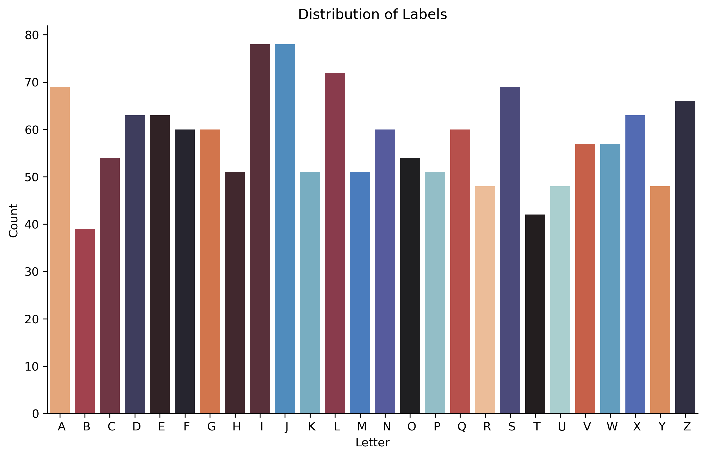
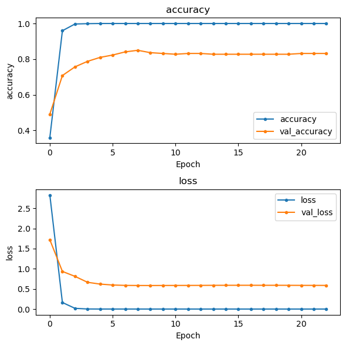
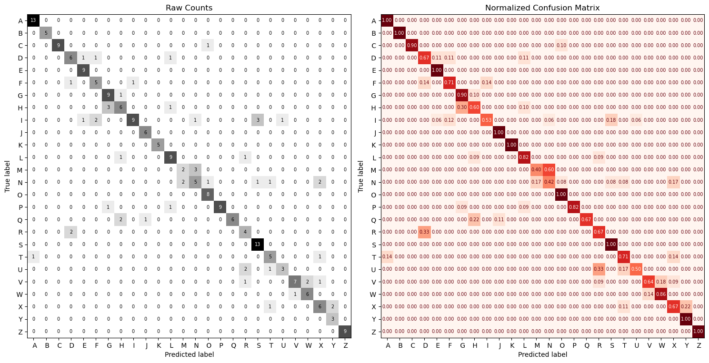
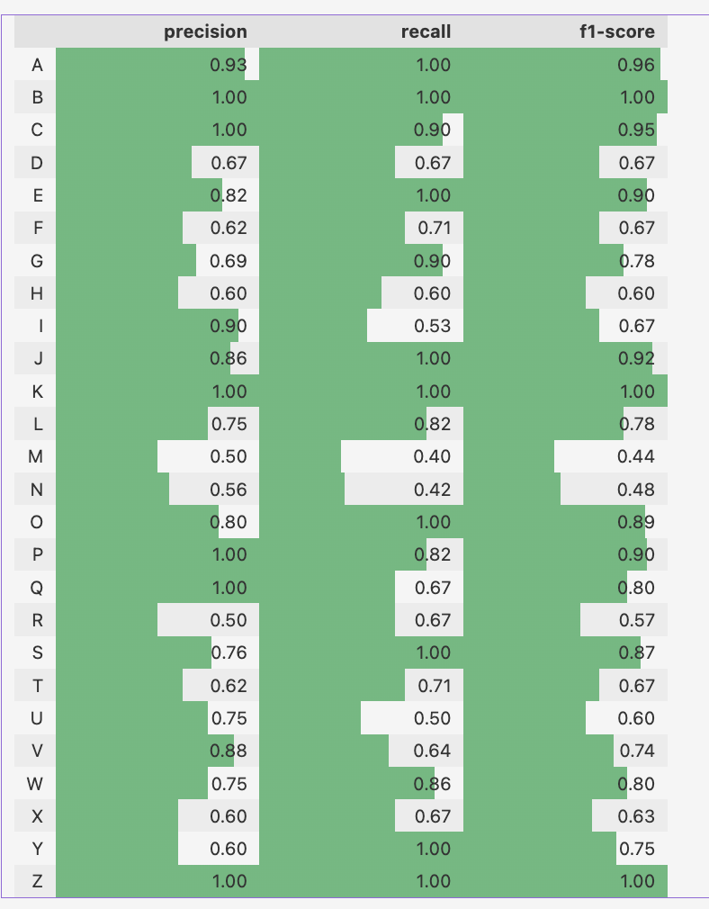

# computer-vision-american-sign-language


<center>
<p>By Psiĥedelisto - Own work, Public Domain, <a href="https://commons.wikimedia.org/w/index.php?curid=53652991">"https://commons.wikimedia.org/w/index.php?curid=53652991</a><p>
</center>

## Description

This project aims to develop a computer vision system for American Sign Language (ASL) recognition. 


### Goals 
> - **The first/primary goal is to create a model that can classify images of letters from the ASL alphabet (26-class multi-classification)**
- Create a streamlit application that will accept an image and predict which letter it is.

> - **The second, above-and-beyond goal is to use video as the input and add object detection.**

### Features

- ASL letter and word translation
- User-friendly interface
- Support for multiple hand gestures

<center> 

<p><a href="https://commons.wikimedia.org/wiki/File:Sign_language_alphabet_(58).png">Image Source</a> </p>
<p> Raziakhatun12, CC BY-SA 4.0 <https://creativecommons.org/licenses/by-sa/4.0>, via Wikimedia Commons</p>

</center>


## Data

### Source/Download
- Public Dataset from [Roboflow](https://public.roboflow.com/object-detection/american-sign-language-letters)


To download:
- Navigate to https://public.roboflow.com/object-detection/american-sign-language-letters
- Click `->` for Downloads.
- Select Format =  Multi-Label Classifiction
- Download zip to computer


### Data Details
- 26 letters of the alphabet
- J and Z are gesture-based letters and will likely be difficult to classify using static images.

- Number of Images: 1731
- Size: 416 x  416 
- Channels: 3

Example of Each letter:


## EDA


### Class Balance





### Methods


- Loading Images as a Tensorflow Dataset object.
    - Image size: 128 x 128
    - Batch size: 32   
    - No data augmentation due to nature of sign language.

- Constructing Convolutional Neural Networks in tensorflow.


#### TO DO:
- [ ] Tune the architecture with keras tuner.
- [ ] Attempt transfer learning
- [ ] Save best model for deployment
- [ ] Create a streamlit application for live inference.


## Results


### Best Model

- EfficientNetB0


#### Test Results




```
---------------------------------------------------------------------
 Classification Metrics: Test Data
----------------------------------------------------------------------
              precision    recall  f1-score   support
    accuracy                           0.78       228
   macro avg       0.78      0.79      0.77       228
weighted avg       0.79      0.78      0.77       228
```







```

CPU times: user 2min 47s, sys: 31.5 s, total: 3min 18s
Wall time: 2min 40s

- Evaluating Test Data:
8/8 [==============================] - 2s 238ms/step - loss: 0.8256 - accuracy: 0.7763
{'loss': 0.8255632519721985, 'accuracy': 0.7763158082962036}
```

